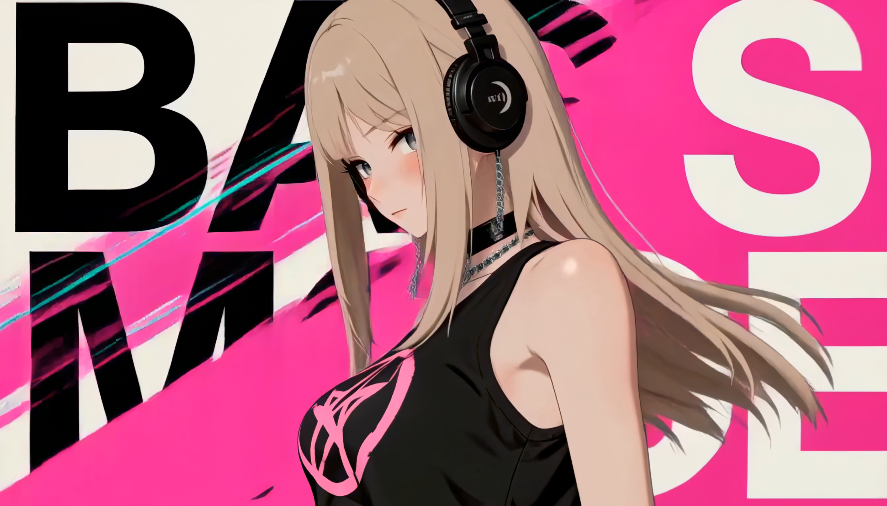
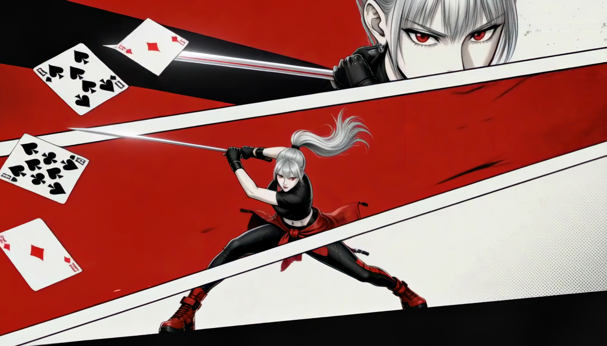
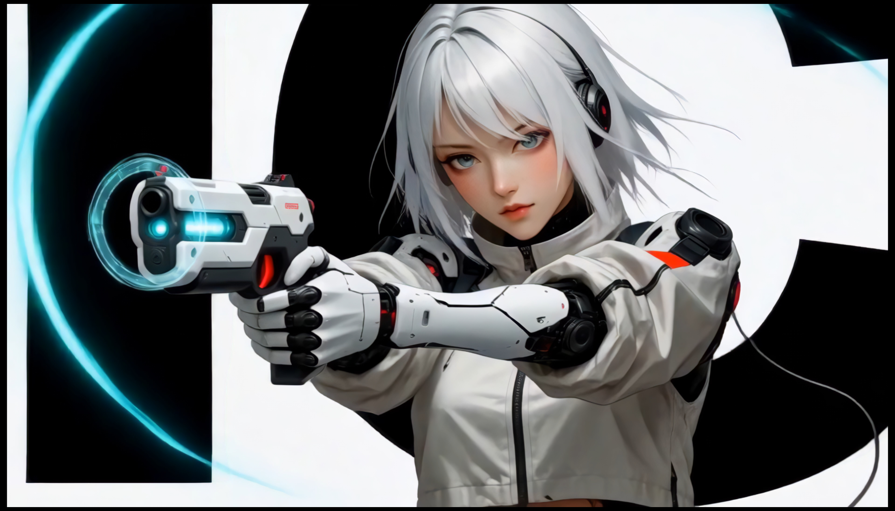

# H3 Comic PV

> Created by 迪威，本仓库从https://github.com/fadeaway20242024/H3-comic-pv复刻，优化了其中部分细节（比如：移除原作者身份路径等）。

**H3 动漫 PV 包装导演 / H3 Anime PV Packaging Director**

An interactive Skill for turning a character image into a structured MiniMax H3 anime PV plan, an approved time-block storyboard, and a production-ready H3 prompt.

<p align="center">
  <a href="#中文说明">中文</a> · <a href="#english">English</a>
</p>

<table>
  <tr>
    <td width="33.33%" align="center">
      <br>
      <strong>COLOR RIOT</strong><br>
      高饱和动漫 PV
    </td>
    <td width="33.33%" align="center">
      <br>
      <strong>GRAPHIC NOIR MANGA</strong><br>
      红白线条感漫画 PV
    </td>
    <td width="33.33%" align="center">
      <br>
      <strong>ICE VECTOR ACTION</strong><br>
      冰蓝动作版式角色 PV
    </td>
  </tr>
</table>

> The images above illustrate the three visual directions. Character identity, typography, props, colors, and motion design should be adapted for each new project rather than copied as a fixed template.

<a id="中文说明"></a>

## 中文说明

`h3-comic-pv` 是一个面向 MiniMax H3 的动漫人物 PV 包装 Skill。它把人物参考图、风格选择、动作设计、镜头衔接、平面包装、音乐和音效整理成一条可执行的 15 秒视频提示词。

它不会在收到人物图后立刻生成最终提示词，而是先给出简版时间段分镜，让使用者确认或修改。只有分镜确认后，才会展开完整的 H3 提示词。

### 适合做什么

- 动漫人物 PV、游戏 CG 人物 PV
- 人物出场片头、角色展示片头
- 动漫人物包装、动态海报、MAD
- 15 秒左右、快切卡点、带音乐与音效的非叙事短片

### 三个固定风格

| 风格 | 适合气质 | 核心表现 |
|---|---|---|
| **COLOR RIOT｜高饱和动漫 PV** | 年轻、热烈、时尚、街头 | 从人物服装提取高饱和配色；眼睛与手部微距；动作遮挡切；彩色色块；英文大字；约 14–16 个切点 |
| **ICE VECTOR ACTION｜冰蓝动作版式角色 PV** | 冷感、未来、科技、克制 | 白色留白；黑色巨型字母；钴蓝几何线条；异元素分屏；道具驱动动作；默认 16 个视觉节拍 |
| **GRAPHIC NOIR MANGA｜红白线条感漫画 PV** | 热血、冷峻、漫画、战斗 | 人物统一二维化；红黑暖白巨型色块；最多四格的逻辑漫画分镜；形状匹配；默认 18 个视觉节拍 |

此外还有第 4 个开放方向：**其他／参考图混合创作**。使用者提供人物图和 1–3 张风格截图，Skill 大约保留 70% 的人物与参考风格特征，再用约 30% 的空间组合一至两组成熟包装技巧。

### 怎么使用

可以显式调用：

```text
使用 $h3-comic-pv，我要用这张人物图制作一条 15 秒、16:9 的动漫人物 PV。
```

也可以直接用自然语言触发：

```text
我想制作一个动漫 PV。
帮我把这个人物做成动漫片头。
给这个角色做一条人物动漫包装。
```

### 标准流程

1. **提出需求**：说明人物、时长、画幅、情绪、道具和标题；没有特别说明时，可以按 15 秒、16:9 规划。
2. **选择风格**：从三个固定风格中选择，或选择“其他／参考图混合创作”。
3. **上传人物图**：最好提供清晰的全身图。没有人物图时，Skill 会先提供 ImageGen 角色基准图提示词。
4. **确认简版分镜**：Skill 先输出约四个时间段，写明画面、人物动作、运镜、包装衔接和音乐情绪，并停下来等待确认。
5. **生成 H3 提示词**：使用者回复“确认”“继续生成视频提示词”或“按这个生成提示词”后，Skill 才会输出一条完整的 15 秒 H3 提示词。
6. **生成与修改**：只有在使用者明确授权素材上传、付费模型和生成操作后，才提交视频任务；结果回来后可以选择保留、局部修改或重做。

### 这个 Skill 会重点控制什么

- 保持人物的脸、发型、服装、道具和主色一致
- 用人物动作驱动运镜，而不是对静态人物机械推拉
- 在 15 秒内安排 1–2 组大幅度身体动作镜头
- 让字母、色块、分屏和几何线条服从同一运动方向
- 先保证镜头衔接流畅，再增加包装特效
- 音乐必须有旋律、和弦和节奏层次，音效只强调关键切点
- 最后保留清晰的英雄定格、标题或 Logo 阅读时间

### 依赖

本 Skill 依赖 MiniMax 官方的 `h3-prompt-writing` Skill。缺少时可安装：

```bash
npx skills add https://github.com/MiniMax-AI/MiniMax-H3 --skill h3-prompt-writing
```

将本项目目录放到全局 Skills 目录后，调用名为：

```text
$h3-comic-pv
```

### 使用提醒

- 样例图只代表视觉方向，不固定复制其中的人物、文案、Logo 或完整构图。
- Skill 默认不会自行上传素材、调用付费模型或发布视频。
- H3 适合生成短标题，不适合直接生成大量准确字幕；长字幕和 Logo 建议后期添加。

<a id="english"></a>

## English

`h3-comic-pv` is an interactive Skill for creating MiniMax H3 anime character PV packages. It turns a character reference, visual direction, action design, camera movement, graphic packaging, music, and sound effects into one production-ready H3 prompt.

The Skill does not jump directly from an uploaded character image to the final prompt. It first presents a short time-block storyboard for review. The full H3 prompt is produced only after the user confirms that storyboard.

### What it is for

- Anime character PVs and game-CG character PVs
- Character reveals, opening packages, motion posters, and MAD edits
- Short non-narrative videos with fast cuts, graphic design, music, and sound effects
- A typical 15-second, 16:9 anime PV workflow

### Three built-in styles

| Style | Best for | Core language |
|---|---|---|
| **COLOR RIOT** | Youthful, energetic, fashion-forward, street-inspired characters | Character-derived saturated colors, eye and hand close-ups, action wipes, bold color fields, oversized English typography, and roughly 14–16 cuts |
| **ICE VECTOR ACTION** | Cool, futuristic, technical, restrained characters | White negative space, oversized black letters, cobalt geometric lines, mixed-element split screens, prop-driven action, and 16 visual beats |
| **GRAPHIC NOIR MANGA** | Intense, graphic, combat-oriented manga characters | Fully redrawn 2D manga treatment, red/black/warm-white fields, logical panels with no more than four cells, shape matches, and 18 visual beats |

A fourth option, **Custom Reference Hybrid**, is also available. The user supplies a character image and one to three style references. The result keeps roughly 70% of the character and reference language while using about 30% controlled freedom to combine one or two compatible techniques from the built-in styles.

### How to use it

Invoke the Skill explicitly:

```text
Use $h3-comic-pv to create a 15-second, 16:9 anime character PV from this image.
```

It can also be triggered by natural requests such as:

```text
I want to make an anime character PV.
Turn this character into an anime opening package.
Create a fast character reveal for this game-CG hero.
```

### Standard workflow

1. **Describe the project**: provide the character, duration, aspect ratio, mood, prop, and title. A 15-second, 16:9 format is a practical default.
2. **Choose a style**: select one of the three built-in directions or Custom Reference Hybrid.
3. **Provide a character image**: a clear full-body reference works best. If none is available, the Skill first writes an ImageGen character-sheet prompt.
4. **Approve the short storyboard**: the Skill returns approximately four time blocks covering visuals, character action, camera response, graphic transitions, and music mood, then pauses for review.
5. **Generate the H3 prompt**: after the user replies with approval, the Skill expands the approved structure into one complete 15-second H3 prompt.
6. **Generate and revise**: a paid or external generation task is submitted only after the user explicitly approves upload scope, authorization, and cost. The returned result can then be kept, revised, or regenerated.

### What the Skill controls

- Character identity, face, hair, costume, prop, and color continuity
- Camera movement driven by character action rather than mechanical motion
- One or two large body-action camera sequences within a 15-second PV
- Typography, color fields, split screens, and geometric lines following one motion axis
- Smooth shot-to-shot continuity before additional effects are introduced
- Melody-led music with harmony and rhythm; sound effects remain secondary
- A readable final hero pose, title, or logo hold

### Dependency

This Skill requires MiniMax's official `h3-prompt-writing` Skill:

```bash
npx skills add https://github.com/MiniMax-AI/MiniMax-H3 --skill h3-prompt-writing
```

After placing this project in a global Skills directory, invoke it with:

```text
$h3-comic-pv
```

### Notes

- The example images demonstrate visual directions only. Do not copy their characters, wording, logos, or complete compositions into a new project.
- The Skill does not upload assets, call paid models, or publish videos without explicit user approval.
- H3 is best used for short titles. Long subtitles and precise logos should normally be added in post-production.
